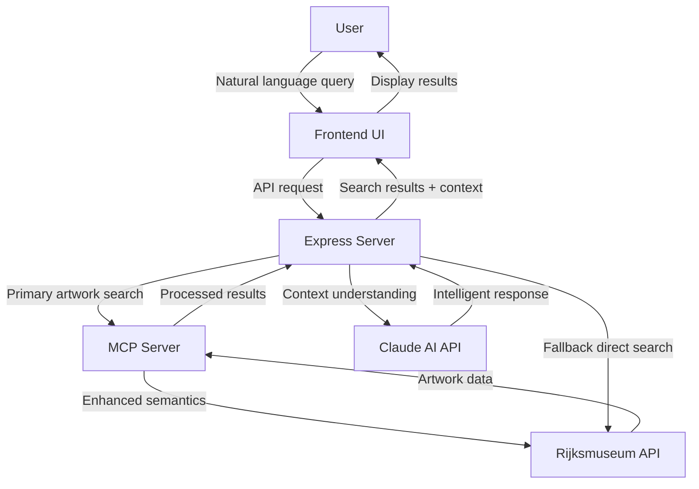

# Rijksmuseum Art Explorer with Claude AI


> *Discover the masterpieces of Dutch art history through natural language conversations!*

## ✨ Live Demo

**[🔗 Try the live demo here!](https://art.bandicoot.media/)**

Experience the Rijksmuseum Art Explorer in action without any installation. Browse thousands of artworks from the Dutch Golden Age and beyond through simple conversational queries.

---


---

## 🌟 Features

- **💬 Natural Language Search**: Ask about artworks in plain English
- **🔍 Intelligent Results**: AI-powered understanding of art queries
- **🖼️ Enhanced Search**: MCP-powered semantic search for thematic art queries
- **🌙 Dark Mode by Default**: Elegant dark theme with light theme toggle
- **📱 Responsive Design**: Works beautifully on both desktop and mobile devices
- **ℹ️ Artwork Details**: View comprehensive information about each artwork
- **🖥️ Fullscreen Viewing**: Click on artwork images to view them in fullscreen mode
- **🔄 Automatic Translation**: Dutch text is automatically translated to English
- **🧠 AI Context Awareness**: Claude understands art periods, styles, and historical context

## 🏛️ About

This application combines the extensive Rijksmuseum collection API with Claude AI and Model Context Protocol (MCP) to create a conversational interface for exploring Dutch masterpieces. The perfect tool for art lovers, students, researchers, or anyone curious about European art history.

## 🚀 Examples of What You Can Ask

```
"Show me paintings by Rembrandt from the 1640s"
"Find all artworks depicting biblical scenes"
"I want to see landscapes with windmills"
"Show me paintings featuring musical instruments"
"What artworks depict scenes from Greek mythology?"
```

## 🏗️ Architecture



- **🖥️ Frontend**: Simple HTML/CSS/JavaScript interface
- **⚙️ Backend**: Node.js/Express server
- **🔍 MCP Server**: Rijksmuseum Model Context Protocol server for enhanced search
- **🔑 Security**: All API keys are securely kept on the server side

## ⚡ Quick Start

1. **Prerequisites**
   ```bash
   # Make sure you have Node.js installed
   node --version
   ```

2. **Installation**
   ```bash
   # Clone the repository
   git clone https://github.com/jdhill777/rijksmuseumAI.git
   cd rijksmuseumAI

   # Install dependencies
   npm install
   ```

3. **MCP Server Setup** (Recommended for better search results)
   ```bash
   # Clone the MCP server repository
   cd ..
   mkdir -p Documents/Cline/MCP
   cd Documents/Cline/MCP
   git clone https://github.com/r-huijts/rijksmuseum-mcp.git
   cd rijksmuseum-mcp
   
   # Install dependencies and build
   npm install
   npm run build
   
   # Start the MCP server (in a separate terminal)
   node build/index.js
   ```

4. **Configuration**
   ```bash
   # Return to the main project directory
   cd /path/to/rijksmuseumAI
   
   # Copy example environment file
   cp .env.example .env

   # Edit .env file with your API keys
   nano .env  # or use any text editor
   ```

   Fill in your API keys:
   ```
   ANTHROPIC_API_KEY=your-anthropic-key
   RIJKSMUSEUM_API_KEY=your-rijksmuseum-key
   MCP_SERVER_URL=http://localhost:3003
   PORT=3002
   HOST=0.0.0.0
   ```

5. **Launch**
   ```bash
   npm start
   ```

6. **Access**
   - Local: [http://localhost:3002](http://localhost:3002)
   - Network: http://YOUR_IP:3002

## 📱 Mobile Access

Scan this QR code to open the app on your phone (when running locally):


(Replace with your actual IP address in production)

## 🔧 Advanced Configuration

### Environment Variables

| Variable | Description | Default |
|----------|-------------|---------|
| `ANTHROPIC_API_KEY` | Your Anthropic API key | Required |
| `RIJKSMUSEUM_API_KEY` | Your Rijksmuseum API key | Required |
| `MCP_SERVER_URL` | URL to your Rijksmuseum MCP server | http://localhost:3003 |
| `PORT` | Server port | 3002 |
| `HOST` | Host binding | 0.0.0.0 |
| `ALLOWED_ORIGINS` | CORS allowed origins | http://localhost:3002* |
| `HOSTNAME` | Custom domain name | Optional |

### Configuration Examples

#### Basic Development
```
PORT=8080
HOST=127.0.0.1
MCP_SERVER_URL=http://localhost:3001
ALLOWED_ORIGINS=http://localhost:8080
```

#### Network Access
```
PORT=3000
HOST=0.0.0.0
MCP_SERVER_URL=http://localhost:3001
ALLOWED_ORIGINS=http://localhost:3000,http://192.168.1.100:3000
```

#### Production Deployment
```
PORT=9000
HOST=0.0.0.0
MCP_SERVER_URL=http://localhost:3001
ALLOWED_ORIGINS=https://your-domain.com
HOSTNAME=your-domain.com
```

## 🐳 Docker Deployment

### Using Docker Compose (Recommended)
```bash
# Start container
docker-compose up -d

# Stop container
docker-compose down
```

### Manual Docker Command
```bash
docker run -d \
  -p 3002:3002 \
  -e ANTHROPIC_API_KEY=your_api_key \
  -e RIJKSMUSEUM_API_KEY=your_api_key \
  -e MCP_SERVER_URL=http://host.docker.internal:3003 \
  -e PORT=3002 \
  -e HOST=0.0.0.0 \
  -e ALLOWED_ORIGINS=http://your-server-ip:3002 \
  --name rijksmuseum-interface \
  rijksmuseum-interface
```

## 🔒 Security Best Practices

- ⚠️ **Never commit your `.env` file to version control**
- 🔄 Regularly rotate your API keys
- 🛡️ Use different API keys for development and production
- 🧪 Consider using environment variables in production
- 🔐 Get API keys from:
  - Anthropic: [console.anthropic.com](https://console.anthropic.com/)
  - Rijksmuseum: [data.rijksmuseum.nl](https://data.rijksmuseum.nl/object-metadata/api/)

## 🛠️ Troubleshooting

| Issue | Solution |
|-------|----------|
| "Port already in use" | Change PORT in .env file |
| Can't connect from mobile | Ensure HOST=0.0.0.0 and devices on same network |
| API errors | Verify API keys are correct in .env |
| Empty results | Check Rijksmuseum API key permissions |
| "MCP server request failed" | Ensure MCP server is running and URL is correct |
| Poor search results | Enable MCP server for better search capabilities |

## 🚀 Deploying to Unraid

To deploy the latest version of the application to your Unraid server:

1. SSH into your Unraid server or access the console
2. Navigate to your Docker container directory
3. Pull the latest changes:
   ```bash
   cd /path/to/rijksmuseum-interface
   git pull origin main
   ```
4. Restart the container:
   ```bash
   docker restart rijksmuseum-interface
   ```
   
Alternatively, you can use the Docker web UI in Unraid to:
1. Update the container by clicking "Update" 
2. Force recreate the container after updating

## 🌐 MCP Server in Production

For production deployment, you should run the MCP server as a separate service:

1. Clone the MCP server repository on your production server
2. Build it using `npm install && npm run build`
3. Run it as a service using systemd, PM2, or Docker
4. Point your main application to the MCP server using the `MCP_SERVER_URL` environment variable

Example PM2 setup:
```bash
pm2 start /path/to/mcp-server/build/index.js --name "rijksmuseum-mcp"
pm2 save
```

## 🤝 Contributing

Contributions are welcome! Feel free to:

1. Fork the repository
2. Create a feature branch (`git checkout -b feature/amazing-feature`)
3. Commit your changes (`git commit -m 'Add amazing feature'`)
4. Push to the branch (`git push origin feature/amazing-feature`)
5. Open a Pull Request

## 📜 License

This project is licensed under the MIT License - see the LICENSE file for details.

## 🙏 Acknowledgements

- [Rijksmuseum](https://www.rijksmuseum.nl/) for their excellent API
- [Anthropic](https://www.anthropic.com/) for Claude AI
- [Model Context Protocol](https://modelcontextprotocol.github.io/) for enhanced search capabilities
- All the Dutch masters whose timeless artworks make this project possible

---

<p align="center">
  Made with ❤️ by <a href="https://github.com/jdhill777">jdhill777</a>
</p>
