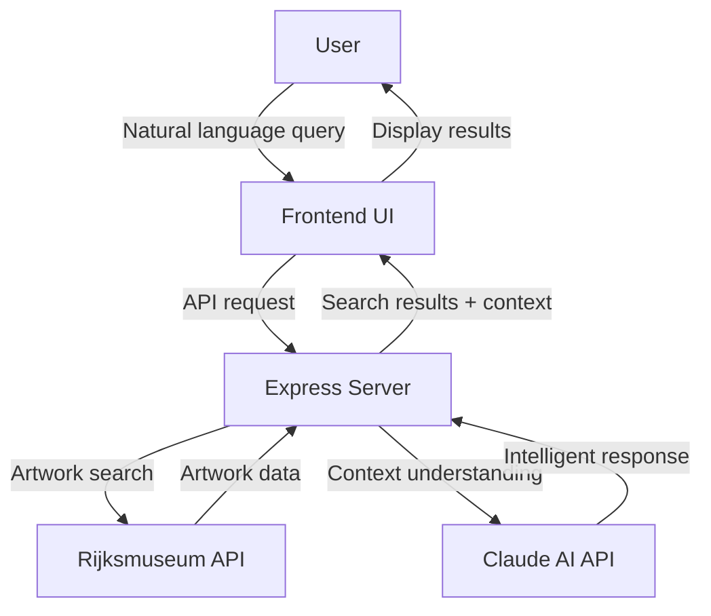

# 🖼️ Rijksmuseum Art Explorer with Claude AI 🤖


> *Discover the masterpieces of Dutch art history through natural language conversations!*

## ✨ Live Demo

**[🔗 Try the live demo here!](https://art.bandicoot.media/)**

Experience the Rijksmuseum Art Explorer in action without any installation. Browse thousands of artworks from the Dutch Golden Age and beyond through simple conversational queries.

---


---

## 🌟 Features

- **💬 Natural Language Search**: Ask about artworks in plain English
- **🔍 Intelligent Results**: AI-powered understanding of art queries
- **🌙 Dark Mode by Default**: Elegant dark theme with light theme toggle
- **📱 Responsive Design**: Works beautifully on both desktop and mobile devices
- **ℹ️ Artwork Details**: View comprehensive information about each artwork
- **🖥️ Fullscreen Viewing**: Click on artwork images to view them in fullscreen mode
- **🔄 Automatic Translation**: Dutch text is automatically translated to English
- **🧠 AI Context Awareness**: Claude understands art periods, styles, and historical context

## 🏛️ About

This application combines the extensive Rijksmuseum collection API with Claude AI to create a conversational interface for exploring Dutch masterpieces. The perfect tool for art lovers, students, researchers, or anyone curious about European art history.

## 🚀 Examples of What You Can Ask

```
"Show me paintings by Rembrandt from the 1640s"
"Find self-portraits by Dutch masters"
"I want to see landscapes with windmills"
"Show me paintings featuring musical instruments"
"What artworks depict scenes from Greek mythology?"
```

## 🏗️ Architecture



- **🖥️ Frontend**: Simple HTML/CSS/JavaScript interface
- **⚙️ Backend**: Node.js/Express server
- **🔑 Security**: All API keys are securely kept on the server side

## ⚡ Quick Start

1. **Prerequisites**
   ```bash
   # Make sure you have Node.js installed
   node --version
   ```

2. **Installation**
   ```bash
   # Clone the repository
   git clone https://github.com/jdhill777/rijksmuseumAI.git
   cd rijksmuseumAI
   
   # Install dependencies
   npm install
   ```

3. **Configuration**
   ```bash
   # Copy example environment file
   cp .env.example .env
   
   # Edit .env file with your API keys
   nano .env  # or use any text editor
   ```

   Fill in your API keys:
   ```
   ANTHROPIC_API_KEY=your-anthropic-key
   RIJKSMUSEUM_API_KEY=your-rijksmuseum-key
   PORT=3000
   HOST=0.0.0.0
   ```

4. **Launch**
   ```bash
   npm start
   ```

5. **Access**
   - Local: [http://localhost:3000](http://localhost:3000)
   - Network: http://YOUR_IP:3000

## 📱 Mobile Access

Scan this QR code to open the app on your phone (when running locally):


(Replace with your actual IP address in production)

## 🔧 Advanced Configuration

### Environment Variables

| Variable | Description | Default |
|----------|-------------|---------|
| `ANTHROPIC_API_KEY` | Your Anthropic API key | Required |
| `RIJKSMUSEUM_API_KEY` | Your Rijksmuseum API key | Required |
| `PORT` | Server port | 3000 |
| `HOST` | Host binding | 0.0.0.0 |
| `ALLOWED_ORIGINS` | CORS allowed origins | http://localhost:3000,* |
| `HOSTNAME` | Custom domain name | Optional |

### Configuration Examples

#### Basic Development
```
PORT=8080
HOST=127.0.0.1
ALLOWED_ORIGINS=http://localhost:8080
```

#### Network Access
```
PORT=3000
HOST=0.0.0.0
ALLOWED_ORIGINS=http://localhost:3000,http://192.168.1.100:3000
```

#### Production Deployment
```
PORT=9000
HOST=0.0.0.0
ALLOWED_ORIGINS=https://your-domain.com
HOSTNAME=your-domain.com
```

## 🐳 Docker Deployment

### Using Docker Compose (Recommended)
```bash
# Start container
docker-compose up -d

# Stop container
docker-compose down
```

### Manual Docker Command
```bash
docker run -d \
  -p 3000:3000 \
  -e ANTHROPIC_API_KEY=your_api_key \
  -e RIJKSMUSEUM_API_KEY=your_api_key \
  -e PORT=3000 \
  -e HOST=0.0.0.0 \
  -e ALLOWED_ORIGINS=http://your-server-ip:3000 \
  --name rijksmuseum-interface \
  rijksmuseum-interface
```

## 🔒 Security Best Practices

- ⚠️ **Never commit your `.env` file to version control**
- 🔄 Regularly rotate your API keys
- 🛡️ Use different API keys for development and production
- 🧪 Consider using environment variables in production
- 🔐 Get API keys from:
  - Anthropic: [console.anthropic.com](https://console.anthropic.com/)
  - Rijksmuseum: [data.rijksmuseum.nl](https://data.rijksmuseum.nl/object-metadata/api/)

## 🛠️ Troubleshooting

| Issue | Solution |
|-------|----------|
| "Port already in use" | Change PORT in .env file |
| Can't connect from mobile | Ensure HOST=0.0.0.0 and devices on same network |
| API errors | Verify API keys are correct in .env |
| Empty results | Check Rijksmuseum API key permissions |

## 🤝 Contributing

Contributions are welcome! Feel free to:

1. Fork the repository
2. Create a feature branch (`git checkout -b feature/amazing-feature`)
3. Commit your changes (`git commit -m 'Add amazing feature'`)
4. Push to the branch (`git push origin feature/amazing-feature`)
5. Open a Pull Request

## 📜 License

This project is licensed under the MIT License - see the LICENSE file for details.

## 🙏 Acknowledgements

- [Rijksmuseum](https://www.rijksmuseum.nl/) for their excellent API
- [Anthropic](https://www.anthropic.com/) for Claude AI
- All the Dutch masters whose timeless artworks make this project possible

---

<p align="center">
  Made with ❤️ by <a href="https://github.com/jdhill777">jdhill777</a>
</p>
